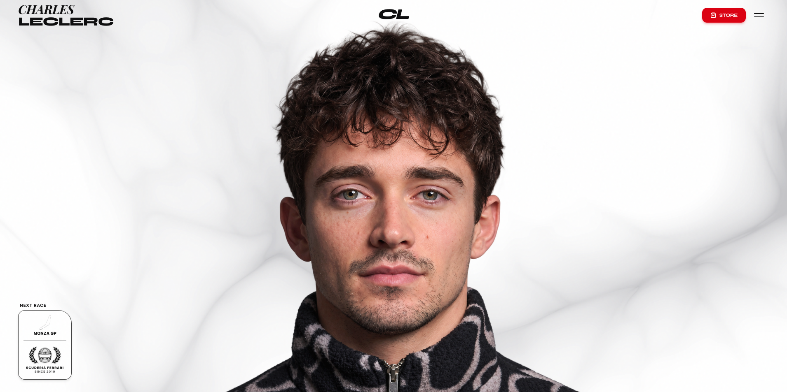

# 🏎️ Charles Leclerc #16 – Scuderia Ferrari HP Official Showcase



[](https://reactjs.org/)
[](https://vitejs.dev/)
[](https://greensock.com/scrolltrigger/)
[](https://www.framer.com/motion/)
[](https://tailwindcss.com/)
[](https://lenis.darkroom.engineering/)

An ultra-luxury, high-performance web experience celebrating Formula 1 driver **Charles Leclerc (#16)** and Scuderia Ferrari HP. Built with cutting-edge creative development techniques, bespoke fluid vector physics, hardware-accelerated Canvas 2D rendering, authentic FIA circuit telemetry, and cinematic scroll choreography inspired by world-class driver platforms.

---

## ✨ Key Features & Technical Highlights

### 1. 🔘 Synchronized Aperture Iris Preloader
* **Mechanical Optical Reticle:** Minimalist optical preloader featuring driver `#16`, radial blade ticks, and a circular SVG progress ring.
* **Smart Percentage Counter:** Sprints from `0%` to `16%`, takes an authentic `0.18s` micro-pause honoring Charles's car number, then smoothly finishes at `100%`.
* **Central Radial Dilation:** Uses a hardware-accelerated CSS `radial-gradient` mask to expand outwards from the center (`r: 0 ➔ 140vmax`), unveiling the Hero Section with an exposure flash snap without page jitter or layout shifts.

### 2. 🌊 Dynamic Fluid Ribbon Trail Mask Engine
* **Tapered Aerodynamic Droplet Vector Spline:** As the cursor sweeps across Charles Leclerc's portrait, it continuously paints an organic liquid ribbon trail that seamlessly reveals his Monaco GP Helmet worn beneath.
* **Direct DOM Path Updating:** Mask paths and backdrop liquid shadows are updated directly via element refs, achieving consistent 60–120 FPS performance with zero React re-render churn.
* **Scale-Compensated Coordinate Mapping:** Computes velocity vectors, normal tangent lines, and sub-step quadratic Bézier curves in real-time.
* **Natural Dissolve / Fade-Out:** Gracefully dissolves within 0.8 seconds of mouse inactivity, returning cleanly to its editorial portrait state.

### 3. 🎬 Cinematic GSAP Scroll Choreography & Hero Reveal
* **Full-bleed Hero Zoom-out:** The fullscreen cover transitions smoothly into a cropped editorial portrait box with authentic Monza GP scooped notch framing.
* **Real-time SVG Signature Drawing:** Charles Leclerc's handwritten signature dynamically draws itself across the screen using animated `stroke-dasharray` and `stroke-dashoffset` mapped to GSAP scroll triggers.
* **Frictionless Unpinning:** Optimized scroll pinning distance eliminates frozen scrolling stalls, flowing seamlessly into the multi-chapter timeline.

### 4. 📖 Cinematic Storytelling Kinetic Scroll
* Dynamic typographic experience where each word illuminates in Monaco Red and pure white as the user scrolls, chronicling Charles's journey from Karting in Brignoles to victory in Monaco & Monza.

### 5. 🏆 Podium Gallery & Dual Identity Split
* **Podium Gallery:** Horizontal scroll cards showcasing landmark Formula 1 victories with bespoke carbon grid styling.
* **Dual Identity (Monaco vs Maranello):** Interactive split comparison highlighting Charles's Monegasque heritage and his passionate Ferrari tifosi spirit.

### 6. 🏁 F1 2026 World Championship Calendar
* **Authentic FIA Circuit Vector Geometry:** 100% authentic vector path geometry for all 24 championship circuits (Albert Park to Yas Marina) — zero generic stock photos.
* **Hyperiux Sliding Highlight Pill:** Swiss tabular list on the left with a smooth white sliding highlight pill that inverts text cleanly to deep black (`#000000`) on hover.
* **Sticky Telemetry Projection Stage:** Right-hand sticky preview chamber rendering glowing Ferrari Red (`#E10600`) circuit vectors, single-line telemetry specs (`Length • Laps • Turns • Leclerc Record`), and live countdown timers.

### 7. 📸 Aperture Gateway & 3D Editorial Zoom Parallax
* **Optical Shutter Gateway:** Fullscreen aperture iris sequence with spacious, non-overlapping viewfinder HUD telemetry (`REC [RAW 4K // 120 FPS]`, `APERTURE: ƒ/1.2 → ƒ/16`, corner brackets).
* **3D Zoom Parallax Archive:** High-impact multi-layer photo grid that expands in 3D perspective space as you scroll, immersing viewers in candid off-track and on-track visual moments.

### 8. 🏎️ Cathedral Arched Motorsport Footer
* **Synchronized 8-Section Navigation:** Complete site navigation with instant smooth scrolling to `#hero`, `#story`, `#podiums`, `#monaco-maranello`, `#calendar`, `#archive-parallax`, `#socials-deck`, and the official Ferrari Store.
* **Handwritten Glowing Signature:** Dynamic SVG draw-in animation in Modena Yellow (`#FFE500`).
* **Infinite Sponsor Ticker:** 60fps marquee ticker showcasing Scuderia Ferrari HP official partners.
* **Direct Business Enquiries CTA:** Magnetic pill button with diagonal light sheen animation.

---

## 🛠️ Tech Stack

* **Core Framework:** React 18.3, Vite 6.4
* **Animations & Physics:** GSAP 3.12 (ScrollTrigger), Framer Motion 13
* **Smooth Scrolling:** Lenis Scroll
* **Styling & Design System:** Tailwind CSS v4, Custom Swiss Editorial Serif & Heavyweight Racing Sans Typography
* **Icons & Assets:** Lucide React, Custom F1 Monaco/Monza GP Photography & Official FIA SVG Vectors
* **Canvas Physics:** HTML5 Canvas 2D, Simplex Noise

---

## 🚀 Getting Started

### Prerequisites
* [Node.js](https://nodejs.org/) (version 18 or higher recommended)
* `npm` or `yarn`

### Installation

1. **Clone the repository:**
   ```bash
   git clone https://github.com/FerrelHD/leclerc-redline.git
   cd leclerc-redline
   ```

2. **Install dependencies:**
   ```bash
   npm install
   ```

3. **Start the local development server:**
   ```bash
   npm run dev
   ```
   Open [http://localhost:3000](http://localhost:3000) in your browser.

4. **Build for production:**
   ```bash
   npm run build
   ```

5. **Preview production build:**
   ```bash
   npm run preview
   ```

---

## 📁 Project Structure

```
leclerc-redline/
├── public/
│   └── images/              # Cutout portraits, official helmet renders, Monaco/Monza textures
├── src/
│   ├── components/
│   │   ├── hero/            # FaceHelmetReveal, MainVisualStack, AnimatedSignature, MonzaHudCard
│   │   ├── sections/        # Navbar, MenuOverlay, StorytellingScroll, PodiumGallery, 
│   │   │                    # MonacoMaranelloSplit, F1Calendar, ArchiveZoomParallax, SocialsDeck, Footer
│   │   └── ui/              # LoadingScreen, CustomCursor, WavesBackground, MagneticEffect, etc.
│   ├── data/                # F1 Calendar circuit vectors, Charles Leclerc career stats
│   ├── App.jsx              # Main layout, Lenis smooth scroll ticker, ScrollTrigger refresh
│   ├── index.css            # Design tokens, Swiss typography, noise overlays, carbon grid textures
│   └── main.jsx             # React DOM entry point
├── package.json             # Project dependencies and build scripts
├── vite.config.js           # Vite configuration with Tailwind CSS v4 plugin
└── README.md                # Project documentation
```

---

## 🏎️ Scuderia Ferrari HP • Charles Leclerc #16
*“We did it at home. We did it at Monaco. For Ferrari.”*
