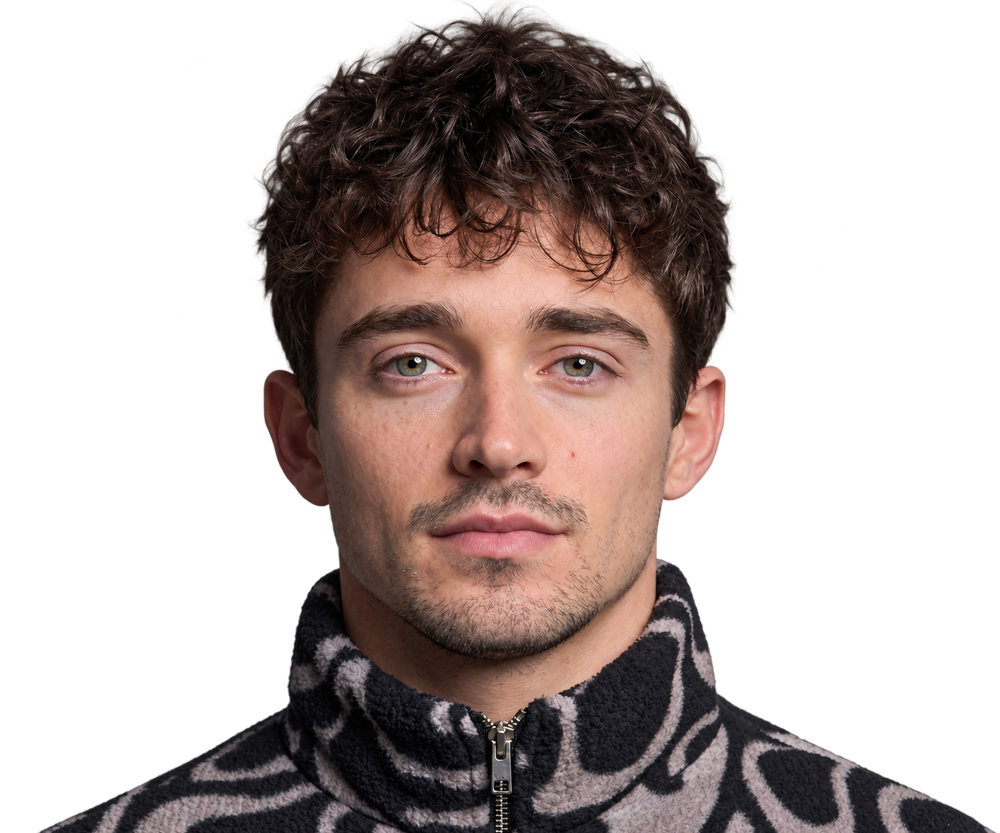

# 🏎️ Charles Leclerc #16 – Scuderia Ferrari HP Official Showcase



[](https://reactjs.org/)
[](https://vitejs.dev/)
[](https://greensock.com/scrolltrigger/)
[](https://www.framer.com/motion/)
[](https://tailwindcss.com/)

An ultra-luxury, high-performance web experience showcasing Formula 1 driver **Charles Leclerc (#16)** and Scuderia Ferrari HP. Built with creative development techniques, bespoke fluid vector physics, hardware-accelerated Canvas 2D rendering, and cinematic scroll choreography inspired by world-class driver platforms like *landonorris.com*.

---

## ✨ Key Features & Technical Highlights

### 1. 🌊 Dynamic Fluid Ribbon Trail Mask Engine
* **Tapered Aerodynamic Droplet Vector Spline:** As the cursor sweeps across Charles Leclerc's portrait, it continuously paints an organic liquid ribbon trail that seamlessly reveals his Monaco GP Helmet worn beneath.
* **Direct DOM Path Updating:** Mask paths and backdrop liquid shadows are updated directly via element refs, achieving consistent 60–120 FPS performance with zero React re-render churn.
* **Physics & Scale-Compensated Coordinate Mapping:** Computes velocity vectors, normal tangent lines ($\vec{n}$), and sub-step quadratic Bézier curves (`Q x y, midX midY`) in real-time, scaled precisely to parent bounding boxes regardless of GSAP CSS transforms.
* **Natural Dissolve / Fade-Out:** The fluid ribbon gracefully dissolves within 0.8 seconds of mouse inactivity, returning the portrait cleanly to its editorial state with zero mask glitching.

### 2. ⚡ High-Performance Canvas 2D Waves Engine
* **GPU-Accelerated 2D Simplex Noise Grid:** Multi-harmonic mathematical wave field that undulates smoothly and reacts organically to mouse velocity and proximity.
* **IntersectionObserver Lifecycle Management:** Automatically suspends rendering loops (0% CPU usage) when off-screen and wakes seamlessly on viewport entry.

### 3. 🎬 Cinematic GSAP Scroll Choreography
* **Full-bleed Hero Zoom-out:** The fullscreen cover transitions smoothly into a cropped editorial portrait box with authentic Monza GP scooped notch framing.
* **Real-time SVG Signature Drawing:** Charles Leclerc's grand signature dynamically writes itself across the screen using animated `stroke-dasharray` and `stroke-dashoffset` precisely mapped to GSAP scroll triggers, featuring artifact-free SVG rendering.
* **Frictionless Unpinning:** Optimized scroll pinning distance (`+=800px`) eliminates frozen scrolling stalls, flowing seamlessly into the multi-chapter timeline.

### 4. 🏆 Helmets Hall of Fame Vault
* High-definition livery showcase honoring his historic triumphs at Monaco and Monza, complete with season telemetry specs and dynamic ambient radial lighting.

### 5. ⏱️ Monza Grand Prix Telemetry HUD
* 1:1 authentic Monaco & Monza GP race telemetry cards with live tire telemetry, lap time indicators, sector delta bars, and official team radio audio player integration.

---

## 🛠️ Tech Stack

* **Frontend:** React 18, Vite
* **Animations & Physics:** GSAP (ScrollTrigger), Framer Motion, HTML5 Canvas 2D, Simplex Noise
* **Smooth Scrolling:** Lenis Scroll
* **Styling & Typography:** Tailwind CSS, Custom Editorial Serif & Heavyweight Racing Sans Typography
* **Icons & Assets:** Lucide React, Custom F1 Monaco GP Photography & SVG Vectors

---

## 🚀 Getting Started

### Prerequisites
* [Node.js](https://nodejs.org/) (version 18 or higher recommended)
* `npm` or `yarn`

### Installation

1. **Clone the repository:**
   ```bash
   git clone https://github.com/FerrelHD/leclerc-redline.git
   cd charles-leclerc
   ```

2. **Install dependencies:**
   ```bash
   npm install
   ```

3. **Start the local development server:**
   ```bash
   npm run dev
   ```
   Open [http://localhost:3000](http://localhost:3000) in your browser.

4. **Build for production:**
   ```bash
   npm run build
   ```

5. **Preview production build:**
   ```bash
   npm run preview
   ```

---

## 📁 Project Structure

```
charles-leclerc/
├── public/
│   └── images/              # Cutout portraits, official helmet renders, Monaco/Monza textures
├── src/
│   ├── components/
│   │   ├── hero/            # Hero Section, MainVisualStack, Fluid Ribbon Mask, Signature
│   │   ├── sections/        # Navbar, MenuOverlay, HelmetVault, OnTrackOffTrack, Footer
│   │   └── ui/              # WavesBackground (Canvas 2D), CustomCursor, TechFrame
│   ├── data/                # Driver stats, helmet archives, audio track metadata
│   ├── App.jsx              # Main application layout, smooth scroll & audio provider
│   ├── index.css            # Global design tokens, typography, and utility classes
│   └── main.jsx             # React DOM entrypoint
├── package.json             # Project dependencies and build scripts
├── vite.config.js           # Vite configuration
└── README.md                # Project documentation
```

---

## 🏎️ Scuderia Ferrari HP • Charles Leclerc #16
*“We did it at home. We did it at Monaco. For Ferrari.”*
